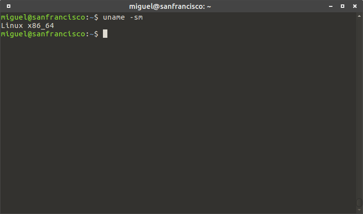

---
# Cabecera ordinaria
title: "Scripting"
subtitle: "Automatizando procesos"
author: "Miguel Sevilla-Callejo"
date: "Enero 2019"

# Variables para HTML con reveal.js
theme: personal1 # simple default personal1
slide_level: 2
transition: convex
highlight: kate

# Variables para exportar a LaTex/PDF
papersize: a4
margin-left: 2cm
margin-right: 2cm
margin-top: 1.5cm
margin-bottom: 1.5cm
---

# Scripting {data-background=#007FFF}

## Script

<h3>Guión de secuencias</h3>

- __Script__: es programa escrito para un entorno en tiempo de ejecución
- Permite automatizar la ejecución de una o varias tareas
- Desde comienzos de la informática (años 60)
- Es una lista de instrucciones a ejecutar por el ordenador

### Ejemplo de comando:

```Bash
# conjunto de comandos
var=$(ls)
echo $var
mv nombre_archivo0 nombre_archivo1
```
## Ventajas de usar scripts

- Manipulación rápida de archivos
- Control de la ejecución de programas
- Abrir simultáneamente varios procesos
- Flexibilidad en el análisis de datos


<iframe src="https://giphy.com/embed/BmmfETghGOPrW" width="480" height="206" frameBorder="0" class="giphy-embed" allowFullScreen></iframe><p><small><a href="https://giphy.com/gifs/reaction-BmmfETghGOPrW">via GIPHY</a></small></p>

## Editar un script

Un script está escrito en texto plano

- Editor de texto (avanzado)
- Interfaz de desarrollo: IDE

Tener cuidado con saltos de línea y codificación entre sistemas operativos

# Lenguajes {data-background=#007FFF}

## Diferencias

__Intérpretes de comandos__

- Comandos de la consola
- Command Line Interface --> CLI
- [vs. Graphical User Interface --> GUI]

__Lenguajes de programación__

- Python, C++, JAVA, R, ...

## Consola de comandos

- Depende del sistema operativo
- CTRL+T en Linux




## Bash


- Bash (Bourne-again shell)
- Intérprete de comando básico de la CLI
- Lenguaje de consola de sistemas "nix"
  - GNU/Linux y macOS

<small>[Bash - Wikipedia, la enciclopedia libre](https://es.wikipedia.org/wiki/Bash)</small>

## PowerShell


- Windows PowerShell
- Interprete de consola avanzado de Windows

<small>[Windows PowerShell - Wikipedia, la enciclopedia libre](https://es.wikipedia.org/wiki/Windows_PowerShell)</small>

# Trabajando con bash {data-background=#007FFF}

## Hello World

Código

```Bash
echo "Hola Mundo"
```
## Principales comandos

- `cd` - cambiar de directorio
- `ls` - listar directorio
- `mkdir` - crear directorio
- `rm` - eliminar archivo

Se acompañan de diferentes opciones

- [GNU Bash manual - GNU Project - Free Software Foundation](https://www.gnu.org/software/bash/manual/)
- [An A-Z Index of the Linux command line | SS64.com](https://ss64.com/bash/)

## Ayuda

- `nombrecomando --help` - ayuda rápida
- `man nombrecomando` - manual interno de Linux

Buscar ayuda en la red

## Script de Bash

Configurar correctamente la cabecera del script

`#!/usr/bin/env bash`

`#!/bin/bash`

Archivo con extensión `.sh` (shell)

## Correr un script

Darle propiedades de ejecución al archivo

```bash
chmod +x nombre_script.sh
```

Correr script en consola:

```bash
./nombre_script.sh
```
<small>Lo anterior se puede realizar desde GUI en el explorador de archivos</small>

## Bucle __if__

```Bash
for i in $(ls *.md);
	do
	echo item: $i
	pandoc -t revealjs -V revealjs-url=./reveal-js -s $i -o $i.html
done
```

## Bucle __while__

# OGR Y GDAL {data-background=#007FFF}

## Referencias

- GDAL main web page [http://www.gdal.org/index.html](http://www.gdal.org/index.html)

- **Mitchel, T.; GDAL Developers 2015.** *GeoSpatial Power Tools. GDAL Raster & Vector Commands*. Locate Press

## warp

- reproject, resample & clip

man gdalwarp - [ http://www.gdal.org/gdalwarp.html](http://www.gdal.org/gdalwarp.html)

## warp - reproject

Comando base

```bash
gdalwarp -s\_srs EPSG:4326 -t\_srs EPSG:25830 -r cubic  -overwrite -of
GTiff  /home/user/data/1km.tif
/home/miguel/GISData/Pyrenees/layers/raster/gtopo\_epsg25830.tif
```

## warp - resample

Comando base

```bash
gdalwarp -overwrite -r bilinear -tr 1000 1000 -of GTiff "/tmp/00_Pluv.asc" /tmp/pluvio1km2.tif
```
`-tr` resolución en x e y

```bash
gdalwarp -overwrite -r bilinear -ts 500 500 -of GTiff /folder/raster_in.asc /folder/raster_out_100m_res.tif
```
`-ts` es para definir el numero de píxeles del raster final 500x500

### warp - clip

```bash
gdalwarp -q -cutline
/home/user/data/polygon.shp
-crop_to_cutline -of GTiff "/home/user/data/dem.tif"
/home/user_data/output_dem.tif
```

## gdalbuildvrt

Ejemplo de creación de un ráster virtual:

```bash
gdal2tiles.py virtualrasterfinename.vrt inputraster1.tif inputraster2.tif inputraster3.tif
```
Se puede usar el comodín en las entrada de archivos ráster: `srtm_12_0*.tif`

## ... EDITANDO
